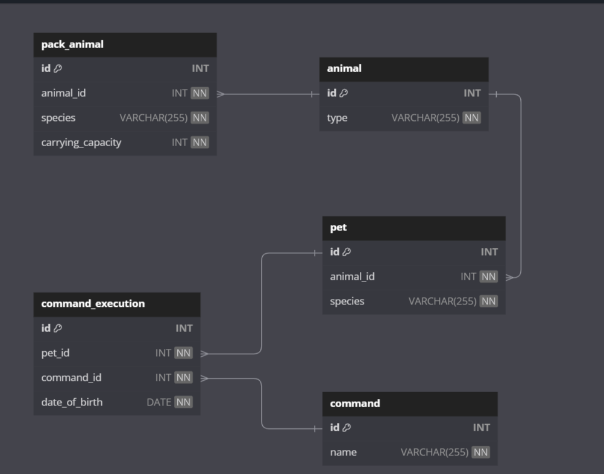

## Система учета для питомника в котором живут домашние и вьючные животные.

## OS Linux (Ubuntu)

### Задание 1

Используя команду cat в терминале операционной системы Linux, создать два файла Домашние животные (заполнив файл собаками, кошками,
хомяками) и Вьючные животными заполнив файл Лошадьми, верблюдами и
ослы), а затем объединить их. Просмотреть содержимое созданного файла.
Переименовать файл, дав ему новое имя (Друзья человека).

### Решение задания 1

```
    # Создаем два текстовых файла: "Домашние_животные" и "Вьючные_животные"
    # с перечислением животных в каждом.

    cat > Домашние_животные <<EOF
    Собака
    Кошка
    Хомяк
    EOF

    cat > Вьючные_животные <<EOF
    Лошадь
    Верблюд
    Осёл
    EOF

    # Объединяем два файла в один под названием "Друзья_человека".

    cat Домашние_животные Вьючные_животные > Друзья_человека

    # Просматриваем содержимое объединенного файла.

    cat Друзья_человека

    # Переименовываем файл "Друзья_человека" в "Друзья_человека.txt",
    # добавляя расширение .txt для ясности.

    mv Друзья_человека Друзья_человека.txt

```


### Задание 2

| Создать директорию, переместить файл туда.

### Решение задания 2

```

# Создаем директорию
mkdir Питомник

# Перемещаем файл
mv Друзья_человека.txt Питомник

```


### Задание 3

| Подключить дополнительный репозиторий MySQL. Установить любой пакет
из этого репозитория.

### Решение задания 3

```
# Добавляем репозиторий
# Загружаю репозиторий
wget https://dev.mysql.com/get/mysql-apt-config_0.8.22-1_all.deb
# Запуск настройки
sudo dpkg -i mysql-apt-config_0.8.22-1_all.deb

# Обновляем список пакетов
sudo apt update

# проверяю кэш пакетов
apt-cache policy mysql-server

# Устанавливаю пакет
sudo apt install mysql-client mysql-server

```

### Задание 4

| Установить и удалить deb-пакет с помощью dpkg.

### Решение задания 4
```

# Устанавливаю
sudo dpkg -i mysql-apt-config_0.8.22-1_all.deb

# Удаляю

sudo dpkg -r mysql-apt-config
```

### Задание 5

| Выложить историю команд в терминале ubuntu

### Решение задания 5

```

# Просмотр истории команд
history

# Сохранение истории команд
history > history.txt

# Очистка истории команд
history -c

```

### Задание 6

Нарисовать диаграмму, в которой есть класс родительский класс, домашние
животные и вьючные животные, в составы которых в случае домашних
животных войдут классы: собаки, кошки, хомяки, а в класс вьючные животные
войдут: Лошади, верблюды и ослы)

### Решение задания 6

